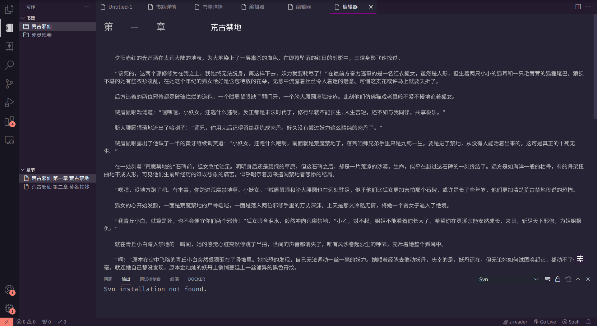

# vscode终于可以用来写小说啦！快来看看这个摸鱼神器插件smart-writter吧

vscode甚至能用来写代码，而今天他能写小说了！是不是觉得有些小伙伴们的摸鱼方式是看小说，为何不试试自己创作呢？别再局限于代码，让Smart Writer助你开创小说写作新纪元！

## 导入工作区
不用再担心新建文件夹和繁琐的配置，你可以将你的工作区导入Smart Writer，让你的小说创作更加高效！是不是有一整个小说的文件夹，等着你进行创作和编辑？

## 懒人福音：新建章节
懒癌患者表示，新建章节太麻烦？！放心，Smart Writer的直观界面让你一秒钟就能新建章节，小说结构一目了然，你只需要专注写作！

## 写小说如虎添翼：智能工具栏
这个智能工具栏可不是吹的，它包含了一系列功能，助你轻松搞定写小说的琐事：

### 格式化
不用再手动弄格式了，一键格式化，小说排版秒变专业！

### 字数统计
随时掌握你小说的字数，不怕写多了还是写少了，节奏自己把控！

### 智能取名功能
懒得想名字？别担心，Smart Writer来帮你，角色名、地点名，通通搞定！

Smart Writer是你写小说的得力助手，不仅实用，还能让你享受创作的乐趣。不要再用无趣的小说编辑器，让VSCode和Smart Writer一起串起你的创作梦想！

别犹豫了，快去安装Smart Writer吧！让它成为你的创作神器，小说创作从此变得轻松、有趣！

[插件安装链接](插件安装链接)

写小说不再是一件枯燥的事，Smart Writer陪你一起玩创作，快来开启小说写作的全新篇章吧！不管是初学者还是老鸟，都能在Smart Writer的陪伴下写出精彩的小说，赶紧安装吧！